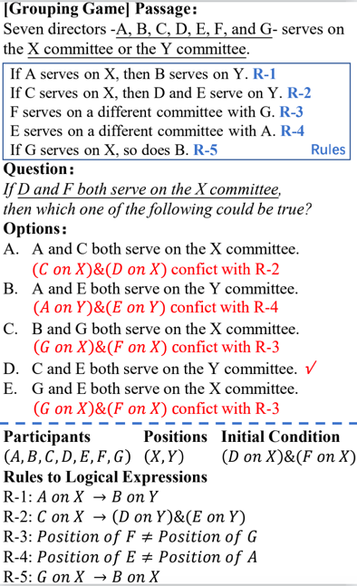

# LSAT
The data and code for the paper [AR-LSAT: Investigating Analytical Reasoning of Text](https://arxiv.org/pdf/2104.06598.pdf).

If you find this paper or this code useful, please cite this paper:
```angular2html
@misc{zhong2021arlsat,
      title={AR-LSAT: Investigating Analytical Reasoning of Text}, 
      author={Wanjun Zhong and Siyuan Wang and Duyu Tang and Zenan Xu and Daya Guo and Jiahai Wang and Jian Yin and Ming Zhou and Nan Duan},
      year={2021},
      eprint={2104.06598},
      archivePrefix={arXiv},
      primaryClass={cs.CL}
}
```
-----
## Data
### Data Example



### Data format
```
[
    {
        "id": ....
        "passage": ...
        "questions": [
            {
                "id": ...
                "fatherId": ...
                "question": ...
                "options": ...
                "answer": ...
            }
    }
]
```
## Transformer-based System
```angular2html
cd Transformer-based Model
bash run_roberta_large.sh
```
Note: 
1. you need to modify the file name in utils_multiple_choice.py
2. you can change different backbone by modifying the --model_name_or_path in the run_roberta_large.sh script
3. for running the LSTM based baseline, pls refer to the same steps
## Analytical Reasoning Machine
1. Step 1: extract named entity recognition (NER), Constinuency Parsing (CP) and Dependency Parsing (DP) results from the original files:
2. Step 2: extract participants, positions from the context
3. Step 3: run pipeline for the dev and test set.
```angular2html
1. 
    cd data_analysis
    python extract_cp_ner_dp_results.py
2. 
    cd data_analysis
    python extract_participant_modify_context_preprocessed.py
3.
    cd pipeline
    python nl2fact_fule.py
    
```
Normally, this pipeline will get the precision:

| Data | Accuracy |
|--------|:--------:|
| Development | 34.2 |
| Test | 30.9 |
